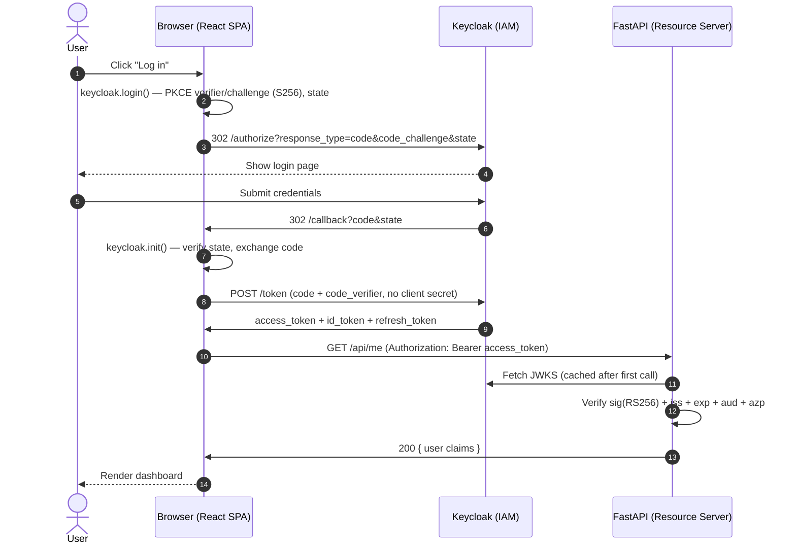
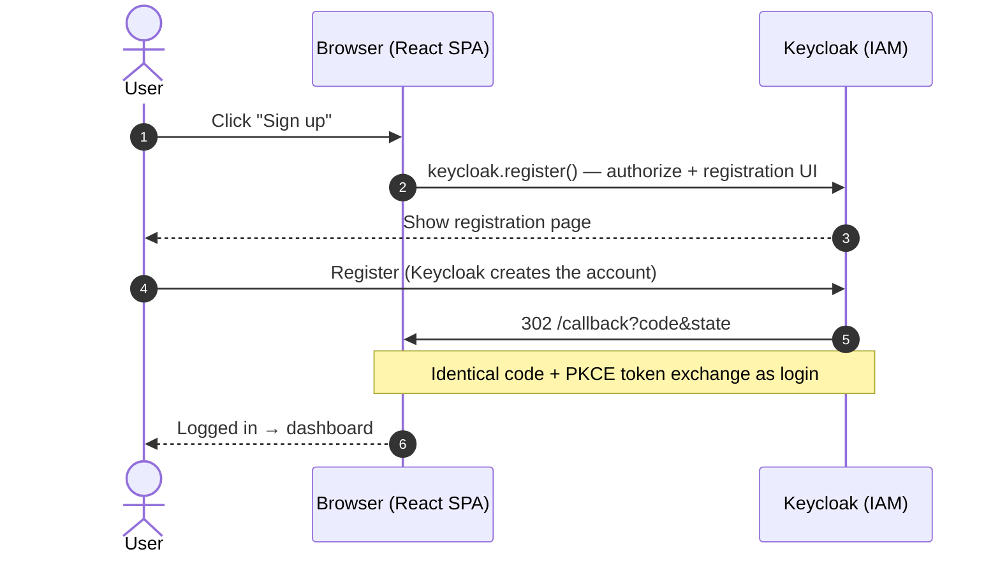
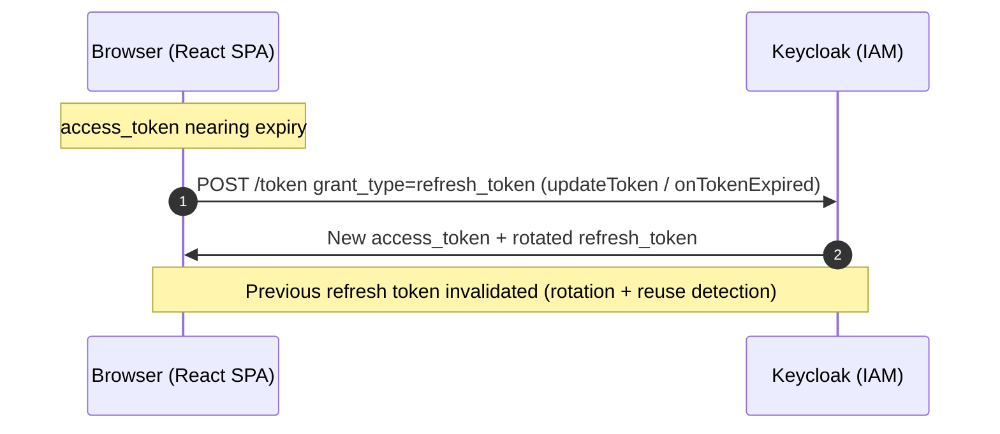
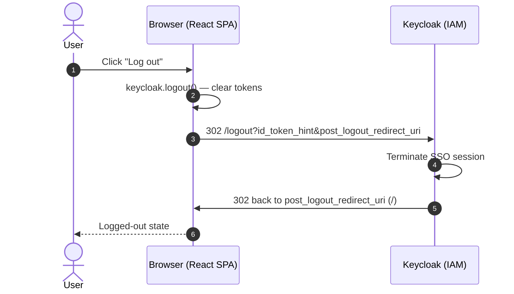

# Authentication Flow Guide — Keycloak + React + FastAPI (SPA OIDC client)

A developer-focused walkthrough of **how this project authenticates users with
Keycloak** — login, signup, tokens, logout — when the **React SPA is the OIDC
client** (authorization code + PKCE). FastAPI only validates JWTs.

Read this if you want to understand *why* it works, not just copy it. Every code
reference points at a real file in this repo.

---

## 1. The one idea: SPA public client + PKCE

The React app **is** the OIDC client. It talks to Keycloak directly (browser
redirects + token exchange). There is **no** backend session cookie for login.

- **React** is a **public** client (no client secret). It uses **PKCE** so the
  authorization code cannot be redeemed without the `code_verifier`.
- Tokens live in the browser (managed by `keycloak-js`).
- **FastAPI** never runs `/auth/login` or code exchange. It only accepts
  `Authorization: Bearer <access_token>` and validates the JWT with Keycloak’s
  JWKS.

```
┌─────────┐   redirect + PKCE code flow    ┌──────────┐
│  React  │ ─────────────────────────────▶ │ Keycloak │
│ (SPA)   │ ◀──── tokens (in browser) ──── │ (:8090)  │
└────┬────┘                                └──────────┘
     │  GET /api/me  Authorization: Bearer …
     ▼
┌──────────┐
│ FastAPI  │  validates JWT via JWKS (no client secret)
└──────────┘
```

**Why not BFF?** A Backend-for-Frontend keeps tokens and the client secret on the
server (httpOnly session). This demo instead shows the **standard SPA pattern**:
public client + PKCE. Prefer BFF when you want secrets/tokens off the page.

---

## 2. The players & where the flow lives

| File | Role |
|---|---|
| `frontend/src/auth/keycloak.js` | `keycloak-js` singleton (`url`, `realm`, `clientId`, PKCE init) |
| `frontend/src/auth/AuthContext.jsx` | `login` / `signup` / `logout` / token access |
| `frontend/src/pages/Callback.jsx` | After init processes `/callback?code&state`, route to dashboard |
| `frontend/src/api.js` | `fetchMe(accessToken)` with Bearer header |
| `backend/app/auth.py` | JWKS JWT validation; `require_user` |
| `backend/app/main.py` | `GET /api/me` only (plus `/health`) |
| `keycloak/import/brandvisual-realm.json` | Public client `react-fastapi-demo` |

Authority (discovery):

`http://localhost:8090/realms/brandvisual/.well-known/openid-configuration`

---

## 3. Login flow (step by step)

```
1. User clicks "Log in"
   React: keycloak.login({ redirectUri: …/callback })
     · keycloak-js generates state + PKCE code_verifier/challenge
     · browser 302 → Keycloak /protocol/openid-connect/auth?...

2. Keycloak shows login; user authenticates.

3. Keycloak 302 → http://localhost:8088/callback?code=...&state=...
   (or :5173 in Vite mode)

4. AuthProvider: keycloak.init({ pkceMethod: 'S256' }) on app load
     · processes the callback URL (code + PKCE verifier)
     · stores tokens; Callback.jsx navigates → /dashboard

5. Dashboard: getAccessToken() → GET /api/me with Bearer token
   FastAPI: verify signature (JWKS) + iss + exp + aud (+ azp defense-in-depth) → return claims
```



---

## 4. Signup flow

Identical to login, except the SPA calls Keycloak’s **`register()`** helper
(official adapter), which opens the registration page while still using the
same authorization-code + PKCE callback:

```js
// AuthContext — signup()
keycloak.register({ redirectUri: `${origin}/callback` })
```

After the user registers, Keycloak redirects to `/callback` with a code — the
token exchange is **identical** to login.

Requires **Realm settings → Login → User registration = ON**.



---

## 5. How “am I logged in?” works

- **In the SPA:** `keycloak-js` keeps access / id / refresh tokens **in memory** on
  the adapter instance after login (not in `sessionStorage`). A hard refresh
  clears them; protected routes (e.g. Dashboard) call `login()` once so Keycloak
  SSO can re-issue tokens without asking for the password again when the IdP
  session is still valid. PKCE callback `state` may use short-lived `localStorage`
  keys — that is not durable token storage.
- **On the API:** presence of a valid Bearer access token — not a session cookie.

```python
# main.py
@app.get("/api/me")
async def me(user: dict = Depends(require_user)):
    return {"user": user}
```

```js
// api.js
fetch('/api/me', { headers: { Authorization: `Bearer ${accessToken}` } })
```

Nginx (or Vite proxy) still forwards `/api` to FastAPI so the browser can call
same-origin `/api/me` without CORS pain in docker mode.

**Token refresh.** Access tokens are short-lived (realm `accessTokenLifespan=300`,
i.e. 5 min). The app refreshes via `keycloak.updateToken(30)` before API calls
**and** on `onTokenExpired`. Keycloak rotates the refresh token on each use with
reuse detection.


---

## 6. Logout flow

```
1. User clicks Log out
   React: keycloak.logout({ redirectUri: …/ })
     · clears local tokens
     · browser → Keycloak end-session
     · Keycloak → post_logout_redirect_uri (/)
```



---

## 7. Pitfalls this project avoids

1. **Use authorization code + PKCE** for SPAs — do not use implicit flow.
2. **Public client** — never put a client secret in frontend code.
3. **Login/signup must be full redirects** (or library-managed redirects), not
   `fetch()` to Keycloak’s authorize URL.
4. **API must validate JWTs** (signature via JWKS, issuer, expiry) — do not trust
   unverified tokens.
5. **Redirect URIs must match exactly** (`/callback` on :8088 and/or :5173).
6. **Call `keycloak.init()` only once** (module-level promise) — React StrictMode
   remounts must not re-init.

---

## 8. Reusable vs. project-specific

| Piece | Reuse as-is | Adapt |
|---|---|---|
| SPA + PKCE architecture | ✅ | |
| `keycloak-js` adapter | ✅ | url / realm / clientId |
| `/callback` page | ✅ | post-login route |
| `keycloak.register()` for signup | ✅ | if self-signup needed |
| FastAPI JWKS `require_user` | ✅ | apply to your routes |
| `sub` as user id | | ✅ map to your user table |
| Browser-held tokens | ✅ demo | ✅ harden for production |

**Minimum to stand this up in a new project:**
1. Create a **public** Keycloak client with PKCE S256 and redirect `<origin>/callback`.
2. Wire `keycloak-js` init + login/register/logout + Bearer `fetch` helpers.
3. Validate access tokens on the API with JWKS (include Keycloak `basic` scope for `sub`).
4. Gate protected routes with `require_user` (or equivalent).

---

## 9. Before production

This guide describes the **flow**. Harden before production: HTTPS only, tight
CORS, short-lived access tokens, careful refresh handling, XSS defenses (tokens
in JS-readable storage are XSS-sensitive — consider BFF/session if that risk is
unacceptable), and Keycloak client hardening. See the README checklist if present.
