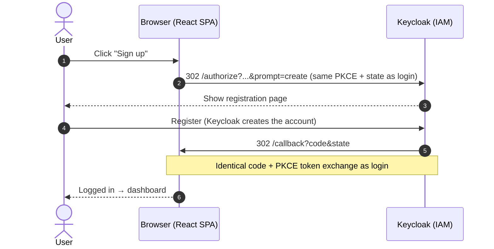
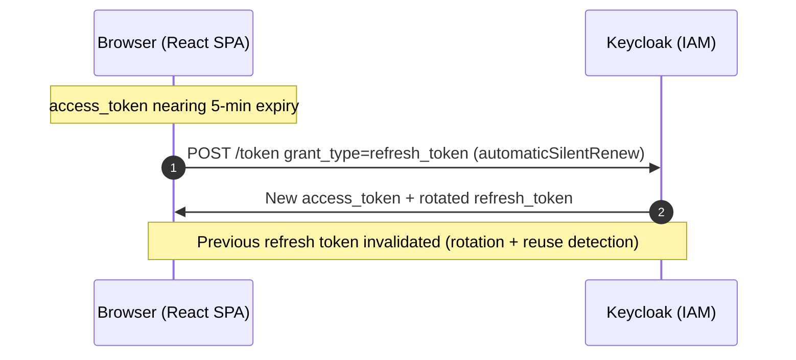
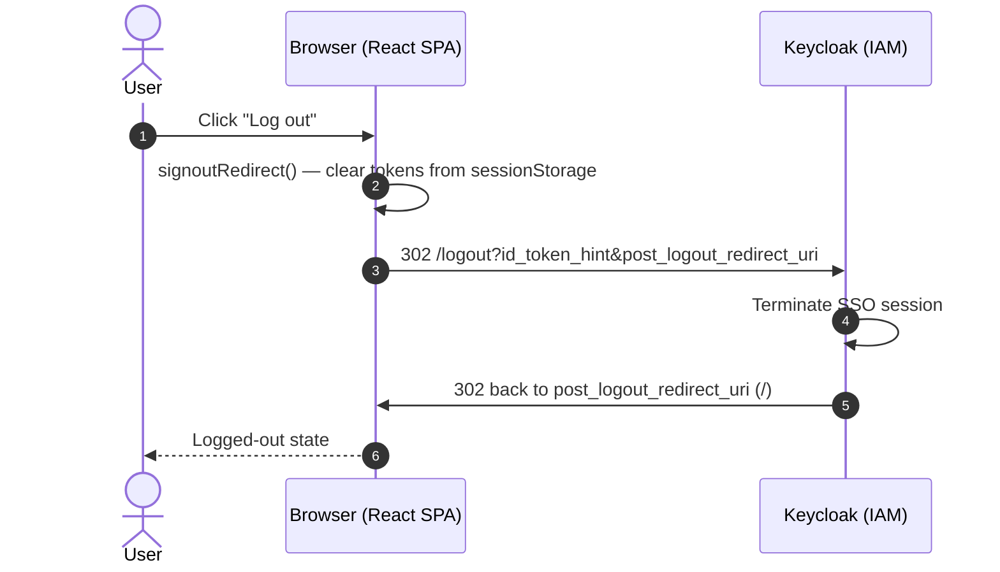

# Authentication Flow Guide — Keycloak + React + FastAPI (SPA OIDC client)

A developer-focused walkthrough of **how this project authenticates users with
Keycloak** — login, signup, tokens, logout — when the **React SPA is the OIDC
client** (authorization code + PKCE). FastAPI only validates JWTs.

Read this if you want to understand *why* it works, not just copy it. Every code
reference points at a real file in this repo.

---

## 1. The one idea: SPA public client + PKCE

The React app **is** the OIDC client. It talks to Keycloak directly (browser
redirects + token exchange). There is **no** backend session cookie for login.

- **React** is a **public** client (no client secret). It uses **PKCE** so the
  authorization code cannot be redeemed without the `code_verifier`.
- Tokens live in the browser (`sessionStorage` via oidc-client-ts).
- **FastAPI** never runs `/auth/login` or code exchange. It only accepts
  `Authorization: Bearer <access_token>` and validates the JWT with Keycloak’s
  JWKS.

```
┌─────────┐   redirect + PKCE code flow    ┌──────────┐
│  React  │ ─────────────────────────────▶ │ Keycloak │
│ (SPA)   │ ◀──── tokens (in browser) ──── │ (:8090)  │
└────┬────┘                                └──────────┘
     │  GET /api/me  Authorization: Bearer …
     ▼
┌──────────┐
│ FastAPI  │  validates JWT via JWKS (no client secret)
└──────────┘
```

**Why not BFF?** A Backend-for-Frontend keeps tokens and the client secret on the
server (httpOnly session). This demo instead shows the **standard SPA pattern**:
public client + PKCE. Prefer BFF when you want secrets/tokens off the page.

---

## 2. The players & where the flow lives

| File | Role |
|---|---|
| `frontend/src/auth/oidc.js` | `UserManager` config (authority, client_id, redirect URIs, PKCE) |
| `frontend/src/auth/AuthContext.jsx` | `login` / `signup` / `logout` / token access |
| `frontend/src/pages/Callback.jsx` | Handles `/callback?code&state` |
| `frontend/src/api.js` | `fetchMe(accessToken)` with Bearer header |
| `backend/app/auth.py` | JWKS JWT validation; `require_user` |
| `backend/app/main.py` | `GET /api/me` only (plus `/health`) |
| `keycloak/import/brandvisual-realm.json` | Public client `react-fastapi-demo` |

Authority (discovery):

`http://localhost:8090/realms/brandvisual/.well-known/openid-configuration`

---

## 3. Login flow (step by step)

```
1. User clicks "Log in"
   React: userManager.signinRedirect()
     · generates state + PKCE code_verifier/challenge
     · stores them in sessionStorage
     · browser 302 → Keycloak /protocol/openid-connect/auth?...

2. Keycloak shows login; user authenticates.

3. Keycloak 302 → http://localhost:8088/callback?code=...&state=...
   (or :5173 in Vite mode)

4. Callback.jsx: userManager.signinRedirectCallback()
     · checks state
     · POSTs code + code_verifier to token endpoint (no client secret)
     · stores User (tokens + profile) in sessionStorage
     · navigate → /dashboard

5. Dashboard: getAccessToken() → GET /api/me with Bearer token
   FastAPI: verify signature (JWKS) + iss + exp + aud (+ azp defense-in-depth) → return claims
```

```mermaid
sequenceDiagram
    autonumber
    actor User
    participant SPA as Browser (React SPA)
    participant KC as Keycloak (IAM)
    participant API as FastAPI (Resource Server)

    User->>SPA: Click "Log in"
    SPA->>SPA: signinRedirect() — make PKCE verifier/challenge (S256), state, nonce
    SPA->>KC: 302 /authorize?response_type=code&code_challenge&state&nonce
    KC-->>User: Show login page
    User->>KC: Submit credentials
    KC->>SPA: 302 /callback?code&state
    SPA->>SPA: signinRedirectCallback() — verify state
    SPA->>KC: POST /token (code + code_verifier, no client secret)
    KC->>SPA: access_token + id_token + refresh_token
    SPA->>SPA: Validate id_token (sig/iss/aud/exp/nonce); store in sessionStorage
    SPA->>API: GET /api/me (Authorization: Bearer access_token)
    API->>KC: Fetch JWKS (cached after first call)
    API->>API: Verify sig(RS256) + iss + exp + aud + azp
    API->>SPA: 200 { user claims }
    SPA-->>User: Render dashboard
```

---

## 4. Signup flow

Identical to login, except the SPA adds the standard OIDC **`prompt=create`**
parameter so Keycloak shows its **registration** page first (Keycloak 25+):

```js
// oidc.js — signinViaRegistration(userManager)
userManager.signinRedirect({ extraQueryParams: { prompt: 'create' } })
```

After the user registers, Keycloak redirects to `/callback` with a code — the
token exchange is **identical** to login.

Requires **Realm settings → Login → User registration = ON**.



---

## 5. How “am I logged in?” works

- **In the SPA:** oidc-client-ts `User` in `sessionStorage` (access / id / refresh).
- **On the API:** presence of a valid Bearer access token — not a session cookie.

```python
# main.py
@app.get("/api/me")
async def me(user: dict = Depends(require_user)):
    return {"user": user}
```

```js
// api.js
fetch('/api/me', { headers: { Authorization: `Bearer ${accessToken}` } })
```

Nginx (or Vite proxy) still forwards `/api` to FastAPI so the browser can call
same-origin `/api/me` without CORS pain in docker mode.

**Silent renew.** Access tokens are short-lived (realm `accessTokenLifespan=300`,
i.e. 5 min). `oidc-client-ts` (`automaticSilentRenew: true`) refreshes them in the
background before expiry using the refresh token; Keycloak rotates the refresh
token on each use with reuse detection.



---

## 6. Logout flow

```
1. User clicks Log out
   React: userManager.signoutRedirect()
     · clears local user store
     · browser → Keycloak end-session (id_token_hint)
     · Keycloak → post_logout_redirect_uri (/)
```



---

## 7. Pitfalls this project avoids

1. **Use authorization code + PKCE** for SPAs — do not use implicit flow.
2. **Public client** — never put a client secret in frontend code.
3. **Login/signup must be full redirects** (or library-managed redirects), not
   `fetch()` to Keycloak’s authorize URL.
4. **API must validate JWTs** (signature via JWKS, issuer, expiry) — do not trust
   unverified tokens.
5. **Redirect URIs must match exactly** (`/callback` on :8088 and/or :5173).

---

## 8. Reusable vs. project-specific

| Piece | Reuse as-is | Adapt |
|---|---|---|
| SPA + PKCE architecture | ✅ | |
| oidc-client-ts `UserManager` | ✅ | authority / client_id |
| `/callback` page | ✅ | post-login route |
| `prompt=create` for signup | ✅ | if self-signup needed |
| FastAPI JWKS `require_user` | ✅ | apply to your routes |
| `sub` as user id | | ✅ map to your user table |
| sessionStorage tokens | ✅ demo | ✅ harden for production |

**Minimum to stand this up in a new project:**
1. Create a **public** Keycloak client with PKCE S256 and redirect `<origin>/callback`.
2. Wire `UserManager` + callback route + Bearer `fetch` helpers.
3. Validate access tokens on the API with JWKS.
4. Gate protected routes with `require_user` (or equivalent).

---

## 9. Before production

This guide describes the **flow**. Harden before production: HTTPS only, tight
CORS, short-lived access tokens, careful refresh handling, XSS defenses (tokens
in JS-readable storage are XSS-sensitive — consider BFF/session if that risk is
unacceptable), and Keycloak client hardening. See the README checklist if present.
